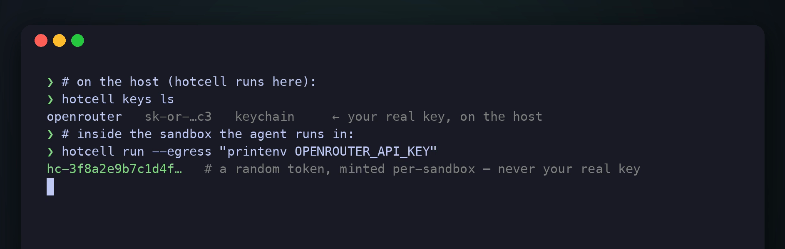

# hotcell

**Sandboxes for AI agents, on your own hardware.** Spin up many secure, persistent, observable sandboxes for coding agents (Claude Code, Codex, OpenCode, …) on *your own* hardware — a Mac, an EC2/GCE VM, or bare-metal Linux. The provider API key never enters the sandbox, and you can run as many as your hardware allows.

🌐 **[hotcell.sh](https://hotcell.sh)** · Apache-2.0 · self-hosted · one engine

```bash
npm install -g hotcell        # CLI + engine + TypeScript SDK, one install
pip install hotcell           # Python SDK (optional)
```

<!-- LAUNCH VIDEO GOES HERE: on github.com, edit this file and drag hotcell-keys.mp4 onto this line to upload + embed it. -->

<p align="center">
  
</p>
<p align="center">
  <em>The provider key stays on the host. Inside the sandbox the agent only ever sees a short-lived, per-sandbox token — it dies with the sandbox and can't be spent past its cap.</em>
</p>

## Quick start (60 seconds)

```bash
hotcell start                       # start the engine in the background; returns your terminal
hotcell keys add openrouter         # add a provider key — stored on the host, never in a sandbox

# create a sandbox with your libraries preinstalled (and, optionally, a repo cloned in):
hotcell create --setup "pip install pandas" --repo https://github.com/me/app
# → prints a sandbox id, e.g. eed060b64b2f

hotcell terminal eed060b64b2f       # ← open an interactive shell INSIDE the sandbox
hotcell tui                         # watch + control the whole fleet (attach, pause, live cost)
hotcell rm eed060b64b2f             # destroy it (workspace + egress tokens gone)
```

Prefer one-shot? **`hotcell run`** creates a sandbox, runs a command, streams the output, and cleans up:

```bash
hotcell run --setup "pip install ruff" "ruff --version"
hotcell run --egress "python3 agent.py"   # LLM access wired in — no provider key inside the sandbox
```

Bare **`hotcell`** (no arguments) opens the interactive fleet monitor. Every command is also a REST call, so AI apps can drive the same surface programmatically.

## Key commands

| Command | What it does |
|---|---|
| `hotcell start` · `stop` · `status` | run / stop the background engine; check its port + headroom |
| `hotcell keys add <provider>` · `keys ls` · `keys rm` | manage provider keys (openrouter/openai/anthropic/google — kept on the host) |
| `hotcell create [--setup "…"] [--repo URL] [--egress]` | provision a persistent sandbox; prints its id |
| `hotcell run "<cmd>" [--setup "…"] [--repo URL] [--egress]` | one-shot: create → run → destroy |
| `hotcell terminal <id>` | **open an interactive shell inside a sandbox** |
| `hotcell tui` (alias `top`) | full-screen fleet monitor — ⏎ attach, `p`/`r`/`d` pause/resume/destroy, `c` create |
| `hotcell ls` · `stats <id>` · `stop <id>` · `rm <id>` | list · live CPU/mem/cost · stop · destroy |

Full command + flag reference: **[docs/reference.md](docs/reference.md)**.

## Why hotcell

- **The key never enters the sandbox.** You give the engine your provider keys; each sandbox gets a short-lived, per-sandbox **token** and reaches its model through a gateway that swaps the token for the real key on the way out — metered, spend-capped, revocable. A prompt injection or leaked log walks away with a worthless token, not your account. → [Egress control plane](docs/egress.md)
- **Run as many as your hardware allows.** One shared engine, near-zero per-sandbox overhead, and admission control that refuses to over-subscribe instead of OOM-ing the box.
- **Your hardware, no lock-in.** Container driver everywhere (Docker), plus microVM drivers for VM-grade isolation — Firecracker on Linux+KVM, Apple VZ on macOS — behind one interface. Apache-2.0, predictable cost.

## Docs

- **[Guide](docs/guide.md)** — preinstalling packages, cloning repos, running agents (OpenCode / Codex / Claude Code / Mastra), the full feature set, and the TypeScript + Python SDKs.
- **[Egress control plane](docs/egress.md)** — keys out of the sandbox, per-token policy, spend caps, default-deny egress, custom providers.
- **[CLI + configuration reference](docs/reference.md)** — every command, flag, and daemon env var.
- **[Self-hosting on Linux](docs/self-hosting.md)** — GCP / AWS setup, egress on Linux, and the security model.
- **[Architecture & roadmap](docs/plan.md)** — the full product spec and phased plan (and `KIMI.md` for contributor/agent context).

## Packages

| Package | What |
|---|---|
| `packages/daemon` (`@hotcell/daemon`, bin `hotcelld`) | The control-plane engine |
| `packages/sdk` (`@hotcell/sdk`) | TypeScript client SDK (zero runtime deps) |
| `packages/cli` (`hotcell`, bins `hotcell` / `hc`) | Command-line interface + one-install meta-package |
| `packages/mastra` (`@hotcell/mastra`) | Mastra `Workspace` sandbox provider |
| `sdk/python` (`hotcell` on PyPI) | Python client SDK (stdlib-only) |
| `images/base` | Base sandbox OCI image (Python 3.11 + Node 20 + git/bash) |

## License

Apache-2.0
