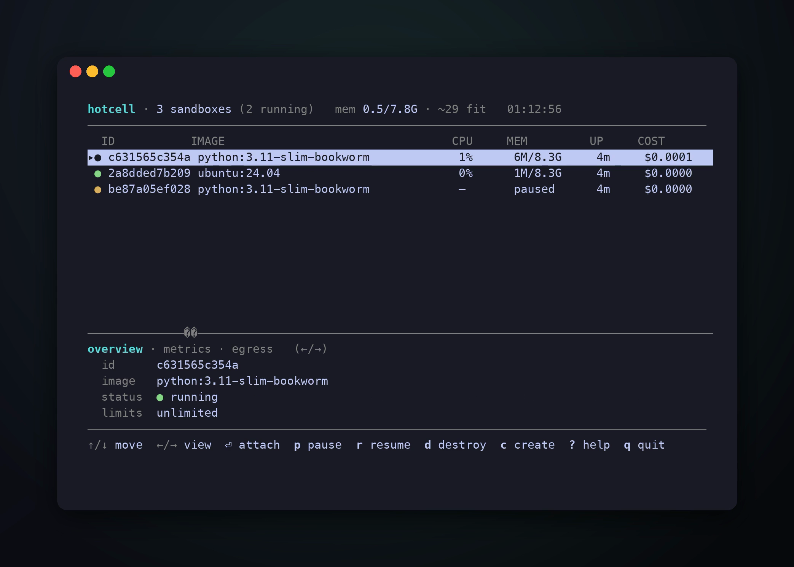

# hotcell

**Sandboxes for AI agents, on your own hardware.** A Mac Mini on your desk, a cloud VM, a bare-metal box — as many isolated agent sandboxes as it can hold, and your API keys never enter any of them.

```bash
npm i -g hotcell
hotcell            # first run: 30-second guided setup — then your live fleet
```

<p align="center">
  
</p>

## The commands that matter

```bash
hotcell keys add openrouter                                       # LLM key — stays on the host, never in a sandbox
hotcell create -n 5 --repo https://github.com/you/app --branch    # five isolated cells, each on its own branch
hotcell terminal <id>                                             # shell inside a cell
hotcell run --setup "pip install ruff" "ruff check ."             # one-shot: create → run → destroy
hotcell rm --all                                                  # everything gone; your repo untouched
```

## Five agents on one repo

```bash
hotcell create -n 5 --name feat --branch --egress \
    --repo https://github.com/you/app --setup "npm i -g opencode-ai"
```

Five isolated cells, each with the repo cloned, its own branch (`feat-1`…`feat-5`), and your agent preinstalled. Open a terminal per cell and put each agent on a different feature:

```bash
hotcell terminal <id>      # inside: cd app && opencode
hotcell rm --all           # done — five cells gone, your repo untouched
```

Your OpenRouter and GitHub keys stay on the host: with `--egress`, a cell only ever holds a short-lived per-cell token, and git/PRs/LLM calls go through hotcell's gateway. Want that fully wired (OpenCode config + keyless `pr` helper) in one go? [`examples/agents.sh`](examples/agents.sh).

<p align="center">
  
</p>

## Why hotcell

- **Keys stay out.** Sandboxes reach LLMs and GitHub through a gateway that swaps a per-sandbox token for the real key — metered, spend-capped, revocable. Optional default-deny egress (kernel-enforced on Linux and microVMs; advisory on macOS Docker).
- **As many as the hardware allows.** One daemon, live CPU/mem/cost per sandbox, admission control that refuses to over-subscribe instead of OOM-ing the box.
- **Containers or microVMs** — Docker everywhere, Firecracker (Linux/KVM) and Apple VZ (macOS) for VM-grade isolation, all behind one interface.

Docs: [guide](docs/guide.md) · [egress & keys](docs/egress.md) · [every command & config](docs/reference.md) · [Linux self-hosting](docs/self-hosting.md) · Python SDK: `pip install hotcell`

## License

Apache-2.0
